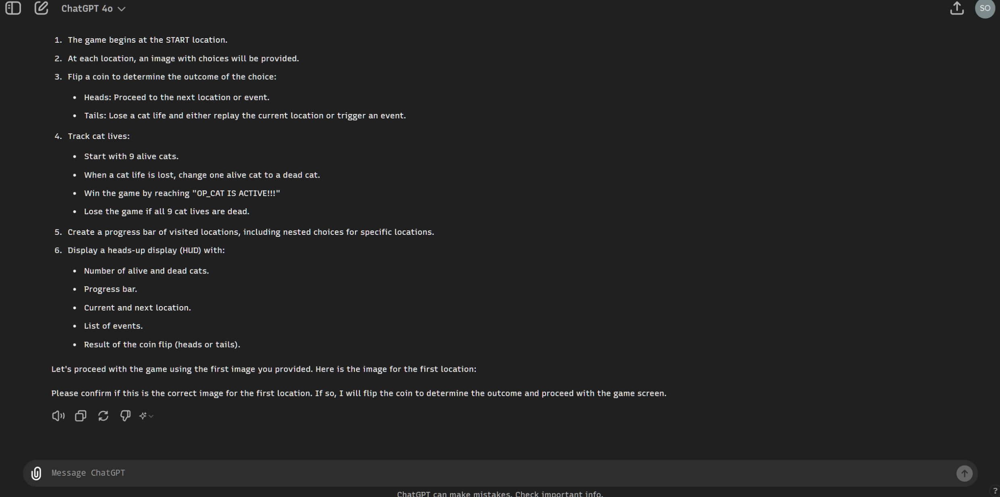
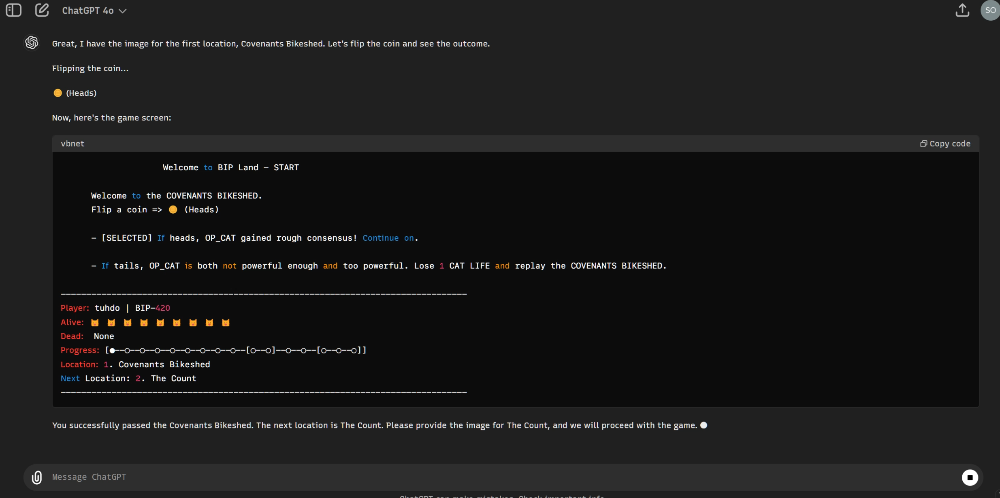

An interactive text game made from the printable board game BIPLand, by Taproot Wizards: https://www.quantumcats.xyz/BIP_LAND_GAMEBOARD.pdf

Demo:

https://twitter.com/i/status/1795476268462539035

To play:

1. Change your username in the prompt in game_prompt.txt.

2. Copy everything in game_prompt.txt.

3. Drag 1.png (the rule image) into the chatbox, paste the prompt and send to ChatGPT. 

4. ChatGPT either confirms the rules, or starts the game immediately.

5. Then, keep dragging images sequentially, e.g. 2.png, 3.png, 4.png

6. There are branches at 11th and 14th checkpoint, so the images are named 11_1.png, 11_2.png, 14_1.png, 14_2.png, 14_3.png
   
   - Depends on the coin results, drag accordingly. Or you can drag them all, e.g. drag both 11_1.png and 11_2.png, but it would take a big longer
   
7. Play until the end, either you win or lose.
